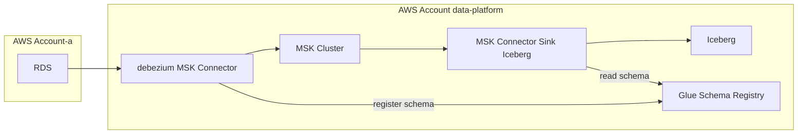

# debezium-mariadb-connector-with-aws-schema-registry-converter

This is a project to build a debezium MariaDB Connector that includes a library for using AWS Schema Registry Converter and AWS Secrets Manager.

## architecture

The assumed architecture is as follows.



## Usage

- build

```console
make
```

- clean

```console
make clean
```
